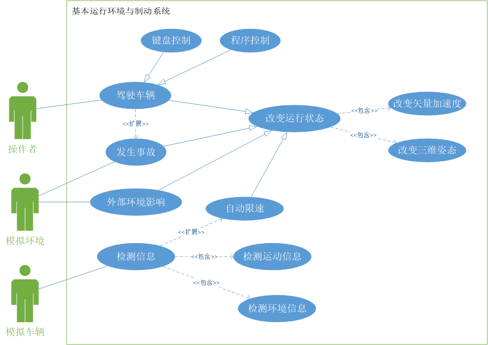
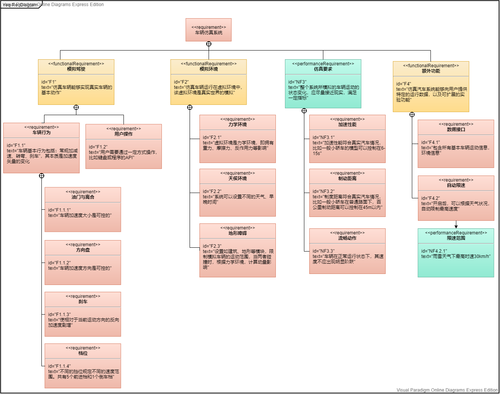

## Hello AIRSIM

+ AIRSIM 是一个类似于游戏的车辆仿真环境,可以通过多种方式操作,比如编程控制,键盘控制,摇杆控制等.

+ 官方推荐使用 C++ 或 Python的API. 个人选择采用Python.

+ 通过官方 github 链接 (https://github.com/microsoft/AirSim/releases/tag/v1.3.1-windows) ,下载已经编译好的仿真程序.官方提供多个仿真环境,比如 City, Soccer_Field, Block等.

  

+ 学习官网教程(https://microsoft.github.io/AirSim/apis/) 

+ pip install airsim 安装控制模块

+ 打开仿真环境后,执行官网提供的 hello_car.py 示例,可以看到车辆会不断地转弯,并打印运行信息. 运行成功!

+ AIRSIM 提供了多种 API.有些关于车辆运动,比如速度、姿态，GPS信息；有些关于环境，比如天气，时间，障碍物信息；还可以拍摄车辆运行时前方视角的不同类型照片。这些信息我们都可以获取或设置。

  我们打印其中控制车辆运动的对象:

  ```python
  # import airsim
  # car_controls = airsim.CarControls()
  <CarControls> {   'brake': 0,
      'gear_immediate': True,
      'handbrake': False,
      'is_manual_gear': False,
      'manual_gear': 0,
      'steering': 0,
      'throttle': 0}
  ```

  给该对象中的属性赋值,便可控制其相应的运动状态.

+ 接下来基于 AIRSIM 提出一些需求, 并利用 AIRSIM 进行测试 . 

  

## 需求分析表

假设我们需要一个简单的车辆仿真系统,能够模拟现实车辆的运行,并且能够读取运行数据,协助用户进行实验或二次开发, 扩展功能.

假设扩展功能: 根据天气情况自动限速

<table>
    <tr align="center">
        <th>需求编号</th>
        <th>需求标题</th>
        <th width = "360px">需求内容</th>
        <th>需求类型</th>
    </tr>
    <tr align="center">
        <td>AIRSIM_F_01</td>
        <td>基本运行</td>
        <td align="left">能够完成基本的运动形态的转换,如加速,刹车,前进,后退,转弯</td>
        <td>功能性需求</td>
    </tr>
	<tr align="center">
   	 	<td>AIRSIM_F_02</td>
    	<td>档位切换</td>
    	<td align="left">拥有档位概念,即不同的挡位会对速度的范围进行限制</td>
        <td>功能性需求</td>
	</tr>
    <tr align="center">
    	<td>AIRSIM_F_03</td>
    	<td>矢量加速度</td>
    	<td align="left">车辆拥有油门,方向盘的概念.即前进的加速度与转弯的角度是可变的</td>
        <td>功能性需求</td>
	</tr>
	<tr align="center">
    	<td>AIRSIM_F_04</td>
    	<td>信息传递</td>
    	<td align="left">使用者能够通过软件获取车辆的基本运动信息,如速度,方向,坐标</td>
        <td>功能性需求</td>
	</tr>
    <tr align="center">
    	<td>AIRSIM_F_05</td>
    	<td>碰撞事故</td>
    	<td align="left">车辆与建筑等障碍物碰撞时,可以发生停止,翻车等事件</td>
        <td>功能性需求</td>
	</tr>
    <tr align="center">
    	<td>AIRSIM_F_06</td>
    	<td>环境影响</td>
    	<td align="left">拥有不同的环境条件,如天气,地形.可以对车辆的运行状态造成影响</td>
        <td>功能性需求</td>
	</tr>
    <tr align="center">
    	<td>AIRSIM_F_07</td>
    	<td>根据环境自动限速</td>
    	<td align="left">车辆能够自动识别天气变化,调整限速范围,防止过快</td>
        <td>功能性需求</td>
	</tr>
    <tr align="center">
    	<td>AIRSIM_NF_01</td>
    	<td>加速度变化合理</td>
    	<td align="left">车辆在主动转换其运动状态时,切换应当合理流畅,符合真实汽车的速度变化趋势</td>
        <td>非功能性需求</td>
	</tr>
    <tr align="center">
    	<td>AIRSIM_NF_02</td>
    	<td>事故影响</td>
    	<td align="left">车辆与建筑等障碍碰撞时运动状态会产生突变.动量计算中障碍的质量设为无穷大</td>
        <td>非功能性需求</td>
	</tr>
    <tr align="center">
    	<td>AIRSIM_NF_03</td>
    	<td>加速性能</td>
    	<td align="left">普通路面下百公里加速所需时间应当合理,若仿真普通轿车,应当在 6-15 s</td>
        <td>非功能性需求</td>
	</tr>
    <tr align="center">
    	<td>AIRSIM_NF_04</td>
    	<td>制动距离</td>
    	<td align="left">普通路面下百公里制动距离应小于 45 m</td>
        <td>非功能性需求</td>
	</tr>
    <tr align="center">
    	<td>AIRSIM_NF_05</td>
    	<td>恶劣环境限速指标</td>
    	<td align="left">雨雪天气下,车辆保持 1 档行驶，最高时速不超过30km/h</td>
        <td>非功能性需求</td>
	</tr>
    </table>


## 用例图与需求规约

### 用例图





### RUCM 用例规约

#### 用例1 驾驶车辆-键盘控制

<table>
    <tr>
        <th width="200px">Use Case Name</th>
        <td colspan="2">驾驶车辆-键盘控制</td>
    </tr>
    <tr>
        <th>Brief Description</th>
        <td colspan="2">通过键盘控制模拟车辆的运动</td>
    </tr>
    <tr>
        <th>Precondition</th>
        <td colspan="2">仿真环境与I/O设备</td>
    </tr>
    <tr>
        <th>Primary Actor</th>
        <td colspan="2">用户</td>
    </tr>
    <tr>
        <th>Secondary Actors</th>
        <td colspan="2">None</td>
    </tr>
    <tr>
        <th>Dependency</th>
        <td colspan="2">None</td>
    </tr>
    <tr>
        <th>Generalization</td>
        <td colspan="2">INHERITED FROM USE CASE 驾驶车辆</td>
    </tr>
    <tr>
        <th rowspan="9">Basic Flow</th>
        <th colspan = "2">Steps</th>
    </tr>
    <tr>
        <th>1</th>
        <td>打开并进入仿真系统</td>
    </tr>
	<tr>
        <th>2</th>
        <td>等待模拟环境与车辆加载完毕,车辆初始速度为0</td>
    </tr>
	<tr>
        <th>3</th>
        <td>系统 VALIDATES THAT 用户长按加速键("W"前进/"S"后退),使车加速</td>
    </tr>
	<tr>
        <th>4</th>
        <td>车辆开始启动</td>
    </tr>
	<tr>
        <th>5</th>
        <td>系统 VALIDATES THAT 按下转弯键("A"左转/"D"右转),使车进行转弯</td>
    </tr>
	<tr>
        <th>6</th>
        <td>系统 VALIDATES THAT 按下刹车键(空格),使车辆快速减速</td>
	</tr>
	<tr>
        <th>7</th>
        <td>自由组合以上控制键</td>
	</tr>
	<tr>
        <th>Postcondition</th>
        <td>成功通过键盘控制仿真车辆的运行</td>
	</tr>
	<tr>
        <th rowspan = '10'>Specific Alternative Flow</th>
        <th colspan="2">BFS 3</th>
	</tr>
	<tr>
        <th>1</th>
        <td>用户不按下加速键</td>
	</tr>
	<tr>
        <th>2</th>
        <td>ABORT</td>
	</tr>
	<tr>
    	<th>Postcondition</th>
    	<td>车辆没有运行</td>
	</tr>
	<tr>
    	<th colspan="2">BFS 5</th>
	</tr>
	<tr>
    	<th>1</th>
    	<td>用户不按下转弯键</td>
	</tr>
	<tr>
    	<th>Postcondition</th>
    	<td>车辆保持原本运行状态</td>
	</tr>
	<tr>
    	<th colspan="2">BFS 6</th>
	</tr>
	<tr>
    	<th>1</th>
    	<td>用户不按下刹车键</td>
	</tr>
	<tr>
    	<th>Postcondition</th>
    	<td>车辆保持原本运行状态</td>
	</tr>
	<tr>
        <td rowspan = '3' style="font-weight:bold">Global Alternative Flow</td>
        <th colspan="2">用户按下重置键(Backspace)</th>
	</tr>
	<tr>
        <th>1</th>
        <td>重置模拟环境,回到初始状态</td>
	</tr>
	<tr>
		<td style="font-weight:bold">Postcondition</td>
		<td>回到 BFS2</td>
	</tr>
</table>


#### 用例2 自动限速

<table>
    <tr>
        <th width="200px">Use Case Name</th>
        <td colspan="2">自动限速</td>
    </tr>
    <tr>
        <th>Brief Description</th>
        <td colspan="2">根据当前环境状况与运动状态,限制车辆运行性能</td>
    </tr>
    <tr>
        <th>Precondition</th>
        <td colspan="2">检测到环境与运动状态信息</td>
    </tr>
    <tr>
        <th>Primary Actor</th>
        <td colspan="2">模拟车辆</td>
    </tr>
    <tr>
        <th>Secondary Actors</th>
        <td colspan="2">None</td>
    </tr>
    <tr>
        <th>Dependency</th>
        <td colspan="2">EXTENDED FROM USE CASE 检测信息<br>
        </td>
    </tr>
    <tr>
        <th>Generalization</td>
        <td colspan="2">INHERITED FROM USE CASE 改变运行状态</td>
    </tr>
 <tr>
        <th rowspan="8">Basic Flow</th>
        <th colspan = "2">Steps</th>
    </tr>
    <tr>
        <th>1</th>
        <td>EXTENDED FROM USE CASE  检测环境信息</td>
    </tr>
	<tr>
        <th>2</th>
        <td>根据环境信息,给出限速区间</td>
    </tr>
	<tr>
        <th>3</th>
        <td>EXTENDED FROM USE CASE  检测运动信息</td>
    </tr>
	<tr>
        <th>4</th>
        <td>开启自动限速功能</td>
    </tr>
	<tr>
        <th>5</th>
        <td>系统 VALIDATES THAT 车辆当前速度超出限速区间</td>
    </tr>
	<tr>
        <th>6</th>
        <td>车辆强制减速,直到低于限制值</td>
    </tr>
	<tr>
        <th>Postcondition</th>
        <td>成功限制车速</td>
	</tr>
	<tr>
        <th rowspan = '4'>Specific Alternative Flow</th>
        <th colspan="2">BFS 5</th>
	</tr>
	<tr>
        <th>1</th>
        <td>车辆速度在限制范围内</td>
	</tr>
	<tr>
        <th>2</th>
        <td>ABORT</td>
	</tr>
	<tr>
    	<th>Postcondition</th>
    	<td>车辆保持原本运行状态</td>
	</tr>
	<tr>
        <td rowspan = '3' style="font-weight:bold">Global Alternative Flow</td>
        <th colspan="2">关闭自动限速功能</th>
	</tr>
	<tr>
        <th>1</th>
        <td>ABORT</td>
	</tr>
	<tr>
		<td style="font-weight:bold">Postcondition</td>
		<td>运行信息依然会检测,但不会自动限速</td>
	</tr>
</table>


## SysML 需求图




## 需求与测试用例关系

经过之前的需求分析，可以看到，我们的需求基本可以概括为 4 个部分，即车辆的仿真驾驶部分，仿真环境部分，以及真实合理的性能表现与扩展功能。每个部分又包含不同的详细需求，并且具有一定的逻辑次序。例如，要首先测试仿真车辆的基本驾驶功能，才能测试与之相关的非功能性需求；车辆仿真驾驶之中，车辆首先要能加速，才可以进行转弯，变档，等等。因此，测试用例设计如下：

<table>
    <tr>
        <th>编号</th>
        <th>名称</th>
        <th>描述</th>
        <th>相关需求</th>
    </tr>
    <tr>
        <td>1</td>
        <td>goForward</td>
        <td>测试车辆在接收相关指令后，是否能够立即产生向前的加速度</td>
        <td>F1.1.1 油门与离合</td>
    </tr>
    <tr>
        <td>2</td>
        <td>turnLeftFront</td>
        <td>测试车辆是否能够在前进时左转弯</td>
        <td>F1.1.2 方向盘</td>
    </tr>
    <tr>
        <td>3</td>
        <td>turnRightFront</td>
        <td>测试车辆是否能够在前进时右转弯</td>
        <td>F1.1.2 方向盘</td>
    </tr>
    <tr>
        <td>4</td>
        <td>brake</td>
        <td>测试车辆是否能够刹车</td>
        <td>F1.1.3 刹车</td>
    </tr>
    <tr>
        <td>5</td>
        <td>handBrake</td>
        <td>测试车辆的手刹功能</td>
        <td>F1.1.3 刹车</td>
    </tr>
    <tr>
        <td>6</td>
        <td>autoGearForward</td>
        <td>测试车辆前进时的自动挡功能（档位随速度自动变化），打印不同档位分界线</td>
        <td>F1.1.4 档位</td>
    </tr>
    <tr>
        <td>7</td>
        <td>manualGearForward</td>
        <td>测试车辆前进时的手动挡功能，每一档都会限制其速度，打印不同档位分界线</td>
        <td>F1.1.4 档位</td>
    </tr>
    <tr>
        <td>8</td>
        <td>manualGearReverse</td>
        <td>测试车辆倒挡功能</td>
        <td>F1.1.4 档位</td>
    </tr>
    <tr>
        <td>9</td>
        <td>turnLeftBack</td>
        <td>测试车辆左后方转弯</td>
        <td>F1.1.2 方向盘</td>
    </tr>
    <tr>
        <td>10</td>
        <td>turnRightBack</td>
        <td>测试车辆右后方转弯</td>
        <td>F1.1.2 方向盘</td>
    </tr>
    <tr>
        <td>11</td>
        <td>throttle</td>
        <td>测试车辆是否有油门/离合概念，即加速度是可变的，throttle 越大，加速越快</td>
        <td>F1.1.1 油门与离合</td>
    </tr>
    <tr>
        <td>12</td>
        <td>steering</td>
        <td>测试车辆是否有方向盘概念，即转弯程度可变，相同初速度下，steering 越大，曲率半径越小</td>
        <td>F1.1.2 方向盘</td>
    </tr>
    <tr>
        <td>13</td>
        <td>resistance</td>
        <td>测试仿真环境是否有阻力系统，即车辆不加速时会自动减速</td>
        <td>F2.1 力学环境</td>
    </tr>
    <tr>
        <td>14</td>
        <td>collision</td>
        <td>测试车辆的运动状态是否会因为碰撞突变，并获取碰撞信息</td>
        <td>F2.3 地形障碍</td>
    </tr>
    <tr>
        <td>15</td>
        <td>weather</td>
        <td>测试仿真环境是否可以设置天气</td>
        <td>F2.2 天侯环境</td>
    </tr>
    <tr>
        <td>16</td>
        <td>datetime</td>
        <td>测试仿真环境是否可以设置日期时间</td>
        <td>F2.2 天侯环境</td>
    </tr>
    <tr>
        <td>17</td>
        <td>accelerateTime</td>
        <td>测试加速性能，指标为百公里加速用时</td>
        <td>NF3.1 加速性能</td>
    </tr>
    <tr>
        <td>18</td>
        <td>brakeDistance</td>
        <td>测试刹车性能，指标为百公里时速下的刹车距离</td>
        <td>NF3.2 制动距离</td>
    </tr>
    <tr>
        <td>19</td>
        <td>smoothAccelerate</td>
        <td>测试车辆加速曲线是否平滑，除换档瞬间外，不应该有明显的阶跃</td>
        <td>NF3.3 流畅动作</td>
    </tr>
    <tr>
        <td>20</td>
        <td>speedLimitByWeather</td>
        <td>测试扩展功能“恶劣天气控制最高速度”，开启以后，若天气为雨雪天气，且度量值不小于0.5时，则只能1档行驶，且最高速度不超过 30km/h 约 8.3 m/s，误差范围控制在 0.5m/s 以内</td>
        <td>F4.2 自动限速；NF4.2.1 限速范围</td>
    </tr>
    <tr>
        <td>21</td>
        <td>speedLimitByWeather-closeLimit</td>
        <td>测试扩展功能“恶劣天气自动限速”，天气的度量值不小于0.5,但不开启限速功能，汽车速度不受影响</td>
        <td>F4.2 自动限速；NF4.2.1 限速范围</td>
    </tr>
    <tr>
        <td>22</td>
        <td>speedLimitByWeather-lowValue</td>
        <td>测试扩展功能“恶劣天气自动限速”，天气的度量值小于0.5,开启限速功能，汽车速度不受影响</td>
        <td>F4.2 自动限速；NF4.2.1 限速范围</td>
    </tr>
</table>


## 扩展功能——恶劣天气自动限速

```python
import airsim
import threading

client = airsim.CarClient()
client.confirmConnection()
client.enableApiControl(True)
car_controls = airsim.CarControls()
car_state = client.getCarState()

'''
	设定天气情况，并选择是否进行速度限制
	调用示例：
		setWeatherOfMyAirSim("Rain", 0.5, True)
	参数说明：
		weather: string, 设定天气类型，参考 weather_list
		value: number, 0~1, 设定天气的程度
		islimit: boolean, True 开启限速功能，False 为关闭
''' 
def setWeatherOfMyAirSim(weather, value, islimit):
    weather_list = {
        "Rain": 0,
        "Roadwetness": 1,
        "Snow": 2,
        "RoadSnow": 3,
        "MapleLeaf": 4,
        "RoadLeaf": 5,
        "Dust": 6,
        "Fog": 7,
        "Enabled": 8
    }

    def limitSpeed():
        while True:
            # 平常由键盘控制
            client.enableApiControl(False)
            # 大于 30 km/h 就减速 
            if client.getCarState().speed > 30 / 3.6:
                client.enableApiControl(True)
                car_controls.brake = 1
                client.setCarControls(car_controls)
                # 直到速度小于临界值，取消减速
                while True:
                    if client.getCarState().speed < 30 / 3.6:
                        car_controls.brake = 0
                        client.setCarControls(car_controls)
                        break

    # 设定天气
    client.simEnableWeather(True)
    client.simSetWeatherParameter(weather_list[weather], value)
    client.enableApiControl(False)
    # 限速触发条件
    if islimit and value >= 0.5:
        client.enableApiControl(True)
        # 最高 1 档
        car_controls.manual_gear = 1
        car_controls.is_manual_gear = True
        client.setCarControls(car_controls)

        # 创建一个线程，随时检测并限制速度
        t = threading.Thread(target=limitSpeed, name='LimitSpeed')
        t.start()
```


## 测试结果

注：以下测试用例，除 speedLimitByWeather 的测试外，车辆运动皆使用 API 控制

<table>
    <tr>
        <th>编号</th>
        <th>测试用例</th>
        <th>测试结果</th>
    </tr>
    <tr>
        <td>1</td>
        <td>goForward</td>
        <td>静止汽车在接受指令后，能够立即启动，并且在行驶过程中会逐渐加速</td>
    </tr>
    <tr>
        <td>2</td>
        <td>turnLeftFront</td>
        <td>前进中的汽车能够左转弯</td>
    </tr>
    <tr>
        <td>3</td>
        <td>turnRightFront</td>
        <td>前进中的汽车能够右转弯</td>
    </tr>
    <tr>
        <td>4</td>
        <td>brake</td>
        <td>刹车能使前进中的汽车较快地减速为0</td>
    </tr>
    <tr>
        <td>5</td>
        <td>handBrake</td>
        <td>手刹能使前进中的汽车较快地减速为0</td>
    </tr>
    <tr>
        <td>6</td>
        <td>autoGearForward</td>
        <td>自动档模式下，档位能够随速度自动变化，1-5档的临界速度分别为约6.1、13.3、20.3、30.8m/s </td>
    </tr>
    <tr>
        <td>7</td>
        <td>manualGearForward</td>
        <td>手动挡模式下，1-5档的最高速度分别为约18.0、34.4、44.1、56.5、60.6m/s </td>
    </tr>
    <tr>
        <td>8</td>
        <td>manualGearReverse</td>
        <td>手动挡模式下，选择倒挡能够成功倒车</td>
    </tr>
    <tr>
        <td>9</td>
        <td>turnLeftBack</td>
        <td>车辆能够左后转弯</td>
    </tr>
    <tr>
        <td>10</td>
        <td>turnRightBack</td>
        <td>车辆能够右后转弯</td>
    </tr>
    <tr>
        <td>11</td>
        <td>throttle</td>
        <td>throttle 越大，加速越快</td>
    </tr>
    <tr>
        <td>12</td>
        <td>steering</td>
        <td>steering 绝对值越大，转弯半径越小</td>
    </tr>
    <tr>
        <td>13</td>
        <td>resistance</td>
        <td>不踩油门时会自动减速至速度为0</td>
    </tr>
    <tr>
        <td>14</td>
        <td>collision</td>
        <td>仿真环境能够发生碰撞，并返回碰撞信息</td>
    </tr>
    <tr>
        <td>15</td>
        <td>weather</td>
        <td>仿真环境能够模拟各种天气类型并改变其程度</td>
    </tr>
    <tr>
        <td>16</td>
        <td>datetime</td>
        <td>仿真环境能够模拟一天的时间，即太阳光照的方向、强度</td>
    </tr>
    <tr>
        <td>17</td>
        <td>accelerateTime</td>
        <td>车辆百公里加速用时约为 12.7s</td>
    </tr>
    <tr>
        <td>18</td>
        <td>brakeDistance</td>
        <td>车辆在 100km/h 速度下的刹车距离约为 56.9 m</td>
    </tr>
    <tr>
        <td>19</td>
        <td>smoothAccelerate</td>
        <td>车辆加速曲线基本平滑，在变档瞬间有些许阶跃。加速度随着速度的增加而变小。符合真实情况</td>
    </tr>
    <tr>
        <td>20</td>
        <td>speedLimitByWeather</td>
        <td>天气度量值不小于0.5的情况下，开启限速。主动通过键盘控制车辆运行，最高速度只能达到8.3m/s左右</td>
    </tr>
    <tr>
        <td>21</td>
        <td>speedLimitByWeather-closeLimit</td>
        <td>天气度量值不小于0.5的情况下，不开启限速。主动通过键盘控制车辆运行，最高速度不被限制</td>
    </tr>
    <tr>
        <td>22</td>
        <td>speedLimitByWeather-lowValue</td>
        <td>天气度量值小于0.5的情况下，开启限速。主动通过键盘控制车辆运行，最高速度不被限制</td>
    </tr>
</table>

